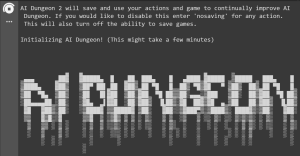
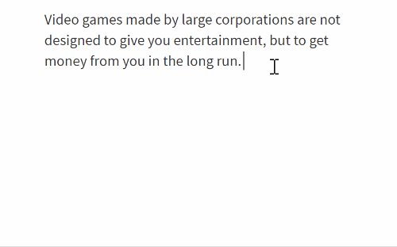

# Awesome Generative Sandboxes 

> Curated list of awesome generative sandboxes, tools where you can interact with a generative algorithm or machine learning model and form really cool stuff based on your input. Think of them like artist tools to quickly generate weird interesting things.

*Please read the [contribution guidelines](CONTRIBUTING.MD) before contributing.*

## Contents

- [Text](#text)
- [Images](#images)

## Text

<table><tbody>
<tr><td width="200">

</td><td>

[AI Dungeon 2](https://colab.research.google.com/github/nickwalton/AIDungeon/blob/ab5a67fdcda4f20651d3158d8a822d1bbf699f2b/AIDungeon_2.ipynb) - A GPT-2 based text based dungeon adventure and story generator

</td></tr>
<tr><td width="200">

</td><td>

[Hugging Face GPT-2 Transformer](https://transformer.huggingface.co/doc/gpt2-large) - Writing pad with GPT-2 based autocomplete, works best with a couple sentences before autocompleting. Hugging Face also has [a ton of other models](https://transformer.huggingface.co/) available to write with.

</td></tr>
</tbody></table>

## Images

<table><tbody>
<tr><td width="200">

</td><td>

[ZZArt](http://zzart.3d2k.com/) - Evolutionary algorithm for messing with GLSL shaders with an export of the associated GLSL code.

</td></tr>
</tbody></table>

## License

To the extent possible under law, [Peter / Cobertos](http://cobertos.com) has waived all copyright and related or neighboring rights to this work.
